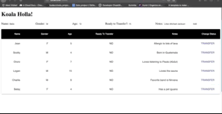

# Koala Holla (Mongodb)

This application demonstrates shows Koalas in a conservancy where they are scheduled to be transferred to a new site.
We built the application from the ground up using 100% more React, Redux, Sagas, Unit Tests, and MongoDB

## SETUP
- Downoad this repo
- npm install
- npm run server
- npm run client

## DESCRIPTION

The user has the ability to mark a Koala ready for transfer. Each koala in the UI has a button that reads 'Ready for Transfer'. When the user clicks on the button, it should update the database for the specific Koala.

## Technologies

* Node
* Express
* React
* Redux
* Redux-Saga
* Jest
* MongoDB and Mongoose

## Setup

- `npm install`
- `npm run server`
- `npm run client`

